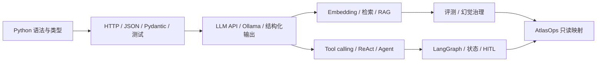

# 一周学习路线图

## 设计判断

用户不是第一次接触软件开发，而是 Python 代码阅读与细节控制需要重建。因此不按传统零基础课程完整推进：Python 与 LLM/Agent 每天并行，所有语法都立刻进入 API、结构化数据、工具调用、状态和测试。

本周不碰大模型训练、CUDA、完整微调、复杂数学推导、云部署、Docker 深入和多个 Agent 框架横向比较。这些内容无法在 56 小时内形成稳定基础，也不是当前读懂 AtlasOps 的第一阻塞项。

## 每日固定节奏

| 模块 | 时间 | 要求 |
|---|---:|---|
| 课程 / 文档输入 | 3 小时 | 只读当天指定章节；视频可 1.25–1.5 倍速 |
| Python 与概念练习 | 2 小时 | 亲自输入、预测输出、运行和修改 |
| 当天小实验 | 2 小时 | 产生可运行结果和至少一个失败案例 |
| 笔记、复述与验收 | 1 小时 | 原始笔记、3–5 分钟脱稿讲解、10–20 题练习 |

连续学习 50 分钟后休息 10 分钟；8 小时是有效投入上限，不用熬夜补“播放进度”。

## 七天总览

| Day | 核心主题 | 8 小时分配 | 当天可观察产出 |
|---|---|---|---|
| 1 | Python 生存基础 + LLM 全景 | Python 4h；LLM 1.5h；练习 1.5h；整理 1h | 命令行文本处理程序；解释变量、集合、函数、异常、模块和 LLM 应用链 |
| 2 | Python 工程基础 + HTTP/API | Python 工程 3h；FastAPI/API 2h；实验 2h；整理 1h | 带 Pydantic 校验、异常和测试的最小 API |
| 3 | LLM 调用 + 结构化输出 | Python SDK 2h；LLM 基础 3h；Ollama 实验 2h；整理 1h | 本地模型调用、流式对照、结构化响应和失败记录 |
| 4 | RAG + 降低幻觉 | Python 数据处理 1.5h；RAG 3.5h；实验 2h；整理 1h | 小文档 RAG 流程图、检索结果和最小评测表 |
| 5 | Agent 原理 + 工具调用 | Python callable/type 1.5h；Agent 3.5h；实验 2h；整理 1h | 两个白名单工具的单 Agent；解释 ReAct、planning、reflection 和终止条件 |
| 6 | LangGraph + 生产约束 | async/test 1h；LangGraph 3h；可靠性 2h；实验 1h；整理 1h | state/node/edge 工作流、人工审批、失败/重试/幂等测试和 trace 草图 |
| 7 | 评测安全 + AtlasOps 映射 | 回顾 1h；评测安全 2h；项目只读 3h；口述 1h；周复盘 1h | AtlasOps 架构图、调用链讲解、20 题周测和下一阶段缺口清单 |

## 依赖关系

## 每日路线

### Day 1 — Python 生存基础与 LLM 全景

- Python：变量、字符串、列表、元组、字典、集合、条件、循环、函数、异常和模块。
- LLM：token、embedding、context、Transformer、推理和 LLM 应用基本链路。
- 产出：命令行文本统计程序；能够解释 Python 核心结构和 LLM 应用链。
- 工作台：[`Day-1/学习记录.md`](../02-每日笔记/Day-1/学习记录.md)

### Day 2 — Python 工程基础与 API

- Python：类型提示、类、dataclass、Pydantic、JSON、HTTP、虚拟环境、pytest、async/await。
- API：FastAPI 请求体、响应模型、错误处理和测试。
- 产出：一个带输入校验、异常处理和测试的最小 API。
- 工作台：[`Day-2/学习记录.md`](../02-每日笔记/Day-2/学习记录.md)

### Day 3 — LLM 调用与结构化输出

- LLM API：messages、role、temperature、streaming、context 和错误处理。
- Ollama：本地调用、OpenAI-compatible 接口、工具声明和结构化输出。
- 产出：流式/非流式对照、Pydantic 结构化响应和失败记录。
- 工作台：[`Day-3/学习记录.md`](../02-每日笔记/Day-3/学习记录.md)

### Day 4 — RAG 与降低幻觉基础

- RAG：加载、清洗、切片、embedding、索引、检索、rerank、上下文和生成。
- 幻觉控制：引用、拒答、证据充分性、检索评测和回答评测。
- 产出：基于 5–10 篇小文档的本地 RAG 流程和最小评测表。
- 工作台：[`Day-4/学习记录.md`](../02-每日笔记/Day-4/学习记录.md)

### Day 5 — Agent 原理与工具调用

- Agent：模型、工具、指令、状态、记忆、观察和终止条件。
- 范式：ReAct、planning、reflection；区分工作流、单 Agent 和多 Agent。
- 产出：一个只允许调用两个白名单工具的单 Agent。
- 工作台：[`Day-5/学习记录.md`](../02-每日笔记/Day-5/学习记录.md)

### Day 6 — LangGraph 与生产工程基础

- LangGraph：state、node、edge、conditional edge、checkpoint 和 HITL。
- 工程：超时、重试、幂等、确定性控制、日志、trace、测试和失败恢复。
- 产出：一个带人工审批和失败路径测试的状态工作流。
- 工作台：[`Day-6/学习记录.md`](../02-每日笔记/Day-6/学习记录.md)

### Day 7 — 评测、安全与 AtlasOps 只读映射

- 评测：组件与端到端评测、离线数据集、成功标准和回归测试。
- 安全：Prompt Injection、输出处理、工具权限和 excessive agency。
- 项目映射：只读分析 AtlasOps 调用链、状态转换、证据流和风险点。
- 产出：架构图、调用链讲解、20 题周测和下一阶段缺口清单。
- 工作台：[`Day-7/学习记录.md`](../02-每日笔记/Day-7/学习记录.md)

## 每日硬验收

必须同时满足才记为完成：

1. 亲自运行当天小实验，而不是只看视频。
2. 在不看资料时用中文解释 3–5 分钟。
3. 完成当天 10–20 道练习题，至少 80% 能说明理由。
4. 记录一个错误：现象、原因、尝试、最终判断和验证。
5. 写下“我现在能做什么”和“仍然不懂什么”。

未通过时不要求重学整天，只把未通过项放入次日第一个 45 分钟补洞。

## Agent 导师的角色

- 学习前：收到 `安排 Day N` 后读取当天笔记，确认唯一目标，不继续 AtlasOps 功能。
- 学习中：回答用户主动提出的问题，解释概念、给最小示例、协助排错。
- 学习后：分别收到整理、出题、复习或调整指令后执行对应动作，不自动串联。
- 只有用户提供运行结果、解释或答案后，才记录验收结论；不根据观看时长自动判定完成。

## 关联

- [`路线索引.md`](路线索引.md)
- [`学习资源.md`](学习资源.md)
- [`学习进度.md`](学习进度.md)
- [`每日整理与验收流程.md`](每日整理与验收流程.md)
