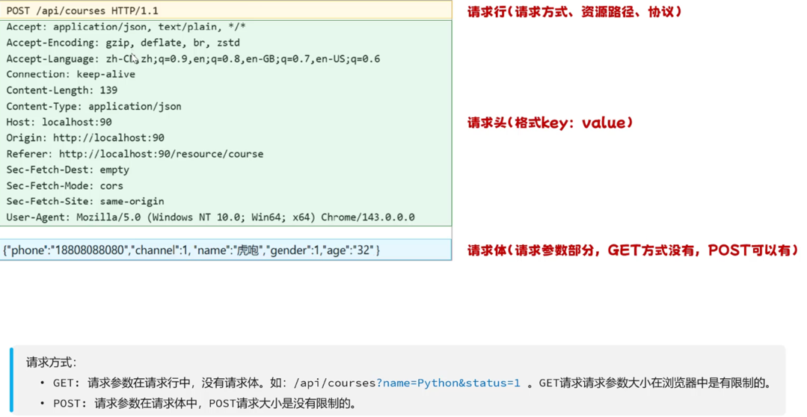
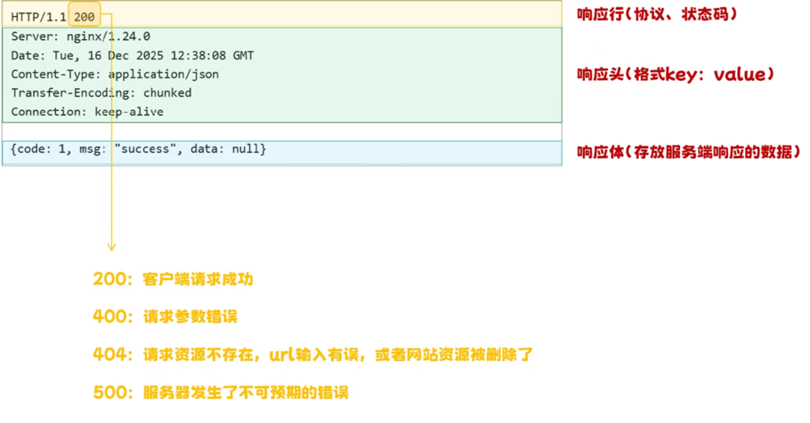
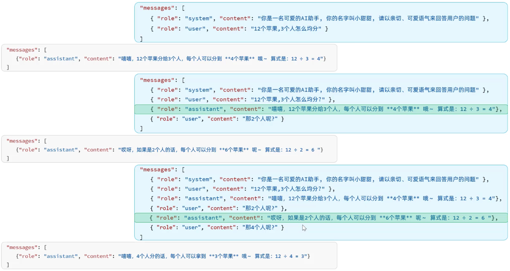

# AI 应用基础

## 大模型部署

1. 本地部署

- 优点：数据安全，自主可控，长期使用成本低
- 初始成本高（设备限制），需要长期维护，性能受限

2. 官方API

- 前期成本低，无序部署和维护，随时访问
- 隐私无法保障，长期成本高，可控性差

3. 云服务平台

- 前期成本低，无序部署和维护，选择度高
- 安全和隐私无法保障，长期成本高

## 大模型调用

### 网络基础知识

1. IP地址：唯一定位一台互联网上的设备（127.0.0.1 为本机地址）
2. 域名：降低IP地址的书写与记忆成本（localhost为本机域名）
3. 端口：每一个程序启动运行后都会占用一个端口（0-65535）
    - https 默认端口为 443
    - http 默认端口为 80

### 网络模型

1. OSI 网络模型：全球网络互联标准模型
2. TCP/IP 网络模型：OSI 简化版

- HTTP协议：Hyper Text Transfer Protocol，超文本传输协议，规定了客户端和服务器之间数据传输的规则。
    - 只有在请求及响应中都遵循了统一的规则，服务端才能读懂客户端发送来的请求，客户端才能解析服务端响应的结果。
    - 特点：
        1. 基于文本的协议：请求和响应的部分的协议内容为文本格式，底层通过TCP协议传输，稳定性强
        2. 基于请求-响应模型： **一次请求对应一次响应**，必须由客户端先发起请求，服务端才会返回响应
        3. 无状态：服务端不会记忆与客户端的历史交互的信息， **每次请求-响应都是独立的**
    - 请求数据格式：
    - 响应数据格式：

### 大模型会话记忆

现状：大模型的交互本质是无状态的，每一次请求响应都是相互独立的。（大模型本身没有真正的会话记忆能力）

#### 会话记忆处理

1. 会话历史滚雪球（将之前的对话历史放入上下文窗口）
    - "role":"system"：系统提示词，设定AI的身份和行为准则（回答风格、限制、规则等）
    - "role":"user"：用户提示词，用户实际发出的指令
    - "role":"assistant"：AI模型的回复/响应，

## 提示词工程

- prompt 是引导大模型进行内容生成的命令，好的提示词应该引导AI思考，约束输出范围，并明确期望结果。
- 提示词工程（prompt engineering）：通过有技巧的编写提示词，使大模型生成出尽可能符合预期的内容：
    - 角色
        - 给大模型设定角色和能力
    - 任务
        - 明确核心请求与任务
        - 按步骤拆解复杂任务
    - 要求
        - 指定风格和语气
        - 明确要求输出格式
        - 提供输入输出的示例
    - **重点**：根据业务场景动态调整提示词