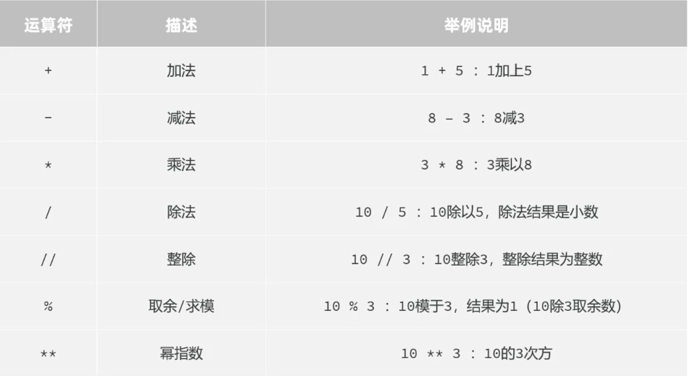
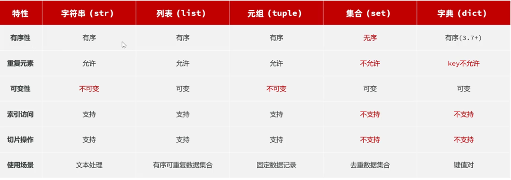
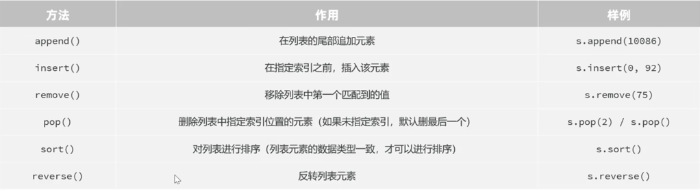
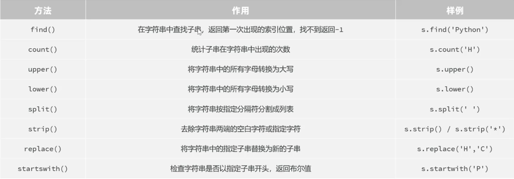
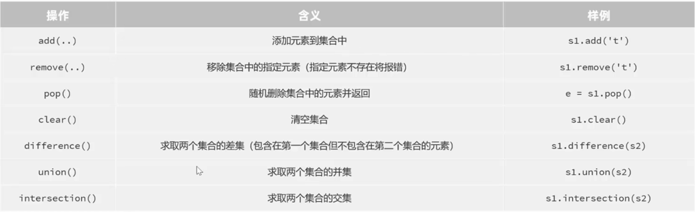
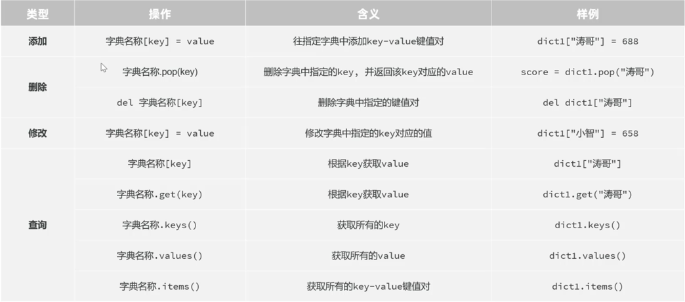
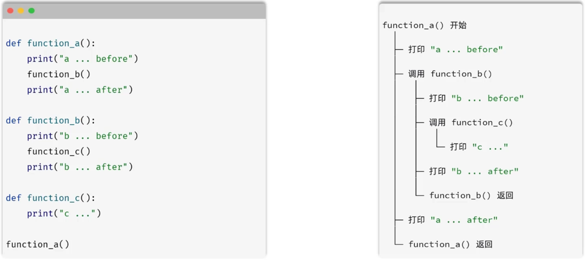
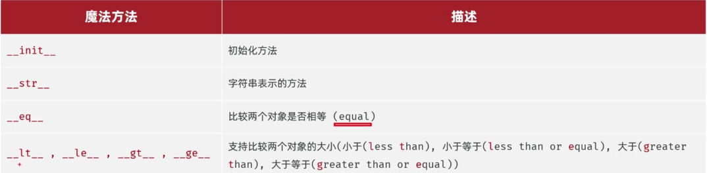

# Python 介绍与安装以及基础操作
## Python 安装
1. 下载 Python 安装包：[Python 官方下载](https://www.python.org/downloads/)
2. 安装 Python 安装包
3. 验证 Python 安装
    - 打开终端交互区
    - 输入 `python3 --version` 查看 Python 版本
        
    ```
    ➜ python3 --version                          
    Python 3.13.7
    ```
---
## python 环境文件
python 虚拟环境：通过虚拟的运行环境，保证每一个Python项目都在一个相对独立的隔离的运行环境中运行，项目之间互不影响
- .venv：虚拟环境文件，用于隔离 Python 环境，保存项目的环境信息
- conda：conda 环境文件，用于隔离 Python 环境

区别：
- .venv 是 Python 自带的虚拟环境工具，而 conda 是一个基于 Python 的环境管理工具
- .venv 是 Python 3.3 以上版本的默认虚拟环境工具，而 conda 是 Python 2.7 以上版本的默认环境管理工具
---
## Python 核心语法
### 数据存储与运算
#### 字面量与变量
- 字面量决定了数据在代码中是怎么写
- 变量决定了数据在代码中怎么存

一、字面量：程序中直接书写的固定值（数据）
字面量的种类（基础数据类型）：
- 整数（int）
- 浮点数（float）
- 字符串（str）
    1. 字符串定义方式：
        1. 单引号：`'hello'`
        2. 双引号：`"hello"`
        3. 三引号（多行字符串）：
           ```python
           s3 = """
           这是一个多行字符串
           可以进行跨行/换行操作
           """
           ```
    2. 字符：文本世界的基本单位。
    3. 字符串拼接：使用 `+` 运算符将多个字符串连接起来。
        - 注意：
            1. 字符串频繁拼接会破坏字符串的完整性
            2. 可以使用类型转换的方式
            3. [[字符串的格式化]]
    4. 常见的转义字符：
        - `\n`：换行
        - `\t`：制表符
        - `\\`：反斜杠
        - `'`：单引号
        - `"`：双引号
    5. 字符串的使用原则：
        - 单引号和双引号是等效的，项目中保持一种写法即可
        - 三引号只适用于多行字符串场景
- 布尔值（bool）：本质就是数字类型，在涉及到数学运算时，会自动将True转换为1，False转换为0。布尔类型字面量首字母必须大写。
- 空值（NoneType）
- 数据容器：存储多项数据的容器，如列表、元组、集合、字典等

```python
# 整数（int）
age = 25
# 浮点数（float）
height = 1.75
# 字符串（str）
message = "This is a String!"
# 布尔值（bool）
is_student = True

print(message)
print(age)
print(height)
print(is_student)
# 查看变量的类型
print(type(age), type(height), type(message), type(is_student))
```

二、变量：程序中用来存储单个数据的容器，通常吧经常发生变化的数据存储在变量中
python 是动态类型语言，在程序运行时才进行类型检查，变量的类型可以在程序运行过程中改变，一个变量可以接收不同类型的数据。

三、标识符：在代码中为变量、函数、类等元素起的名字
命名规则：
1. 只能包含字母、数字、下划线
2. 不能以数字开头
3. 不能使用关键字
4. 严格区分大小写

命名规范（coding style）：
1. 见名知意
2. 多个部分使用下划线链接
3. 英文字母全部小写
注：PEP8 是 Python 官方推荐的代码规范规范，建议在编写 Python 代码时遵循 PEP8 规范。链接：[PEP8 规范](https://www.python.org/dev/peps/pep-0008/)。


#### 输入与输出
- input 语句（函数）：获取键盘输入的数据，具体的用法为：`s = input(提示信息)`
- print 语句（函数）：输出数据到控制台，具体的用法为：`print(要输出的数据)`
```python
# input(...)
name = input("Please enter your name: ")
print(f"Hello, {name}!")

age = input("Please enter you age: ")
print(f"your age is {age}")
```
小知识补充：
1. getpass.getpass()：也是读键盘，但在真实终端里输入时不回显（连 * 都不显示），程序仍然把值存进变量。它的目的是防人肉窥屏（shoulder surfing），不是加密。
    - getpass 只是"视觉脱敏"，不是真的安全。 它读进来的密码仍然以明文字符串存在内存里，程序员照样能拿到、打印、存文件或写日志。真正的"不泄露"要靠：不打印/不写日志/不硬编码/用完清掉内存等，那是另外的工程层防护，getpass 一句话给不了。
    - 在 IDE 内嵌控制台（如 PyCharm 的 Python Console）里 getpass 经常不生效，会退化成普通输入或弹警告。要看到真正隐藏效果，请在系统终端（Terminal）里用 python3 跑这个文件。
2. pwinput.pwinput()：是 pwinput 库的一个函数，用于读取密码输入。它在真实终端里回显星号，同时把输入的密码存储在内存中，不直接打印到屏幕。

#### 运算符
1. 算数运算符：算数运算符的优先级：幂指数 > 乘、除、取模、整除 > 加、减
2. 赋值运算符：
3. 比较运算符：用于比较两个值之间的关系。会计算运算符两边的表达式，然后返回一个布尔值作为结果
4. 逻辑运算符：用于连接多个条件（布尔）表达式（其值为 True 或 False ），并返回一个布尔结果的运算符。

### 数据逻辑处理
#### 流程控制语句
1. [[条件判断]]
2. 模式匹配（相当于Java中的Switch）
3. 循环（for/While）

```python
# 遍历列表/元组中的每个元素
for f in fruits:
    print(f)

# 遍历数字序列
# 常见搭配可以使用 range() 函数
# range从 0 开始计数
for i in range(5):
    print(i)

# 遍历数字序列+复杂操作
# 例如：计算 0 到 4 的平方
for i in range(5):
    print(i ** 2)
```

### while 循环

```python
# while 循环
# 例如：打印 0 到 4 的数字
i = 0
while i < 5:
    print(i)
    i += 1
```
### 数据存储容器

定义：一种可以容纳多分数据的数据类型（容器），容纳的每一份数据称之为1个元素，每一个元素都可以是任意类型的数据。



#### 列表 list

1. 特点：

- 可以存储不同类型的元素
- 元素有序、可以重复、元素可以修改
```python
# 定义一个列表变量
numbers = [1, 2, 3, 4, 5]
fruits = ["apple", "banana", "orange"]
# 输出：[1, 2, 3, 4, 5]
print(numbers)
# 输出：['apple', 'banana', 'orange']
print(fruits)

# 查看列表的类型
# 输出：<class 'list'>
print(type(numbers))

# 注意：
# 1. 列表中的元素是可以修改的
# ```python
# 修改列表中的元素
fruits[0] = '李子'
# 输出：['李子', 'banana', 'orange']
print(fruits)
# 2. 元素可以添加到列表中
# 添加元素到列表中
fruits.append('peach')
# 输出：['李子', 'banana', 'orange', 'peach']
print(fruits)
```

2. 切片
    - 介绍：切片是指对操作的数据截取其中一部分的操作。列表、字符串、元组都支持切片操作
    - 语法：`序列数据[开始索引:结束索引:步长]`
        - 不包含结束索引位置对应的元素
            - 开始索引位置定默认为0；
            - 结束索引未指定默认为列表长度直到列表末尾；
            - 步长未指定默认为1
        - 索引采用正向、反向索引都可以
        - 步长是选取间隔，默认步长为1
    - 切片依旧是list类型，相当于subList

```python 
     lista = ["A", "C", "E", "B", "D", "E", "G"]
# 切片1 s[0:5:1] 含义：从索引为 0 的位置开始切，截取到索引为 5 的位置，每 1 个切一次（步长） 
# 结果为: ['A', 'C', 'E', 'B', 'D']
slice1 = lista[0:5:1]
# 切片2 s[0:5:2] 含义：从索引为 0 的位置开始切，截取到索引为 5 的位置，每 2 个切一次（步长） 
# 结果为: ['A', 'E', 'D']
slice2 = lista[0:5:2]
# 切片3 s[0:-2:1] 含义：从索引为 0 的位置开始切，截取到反向索引为 -2 的位置，每 1 个切一次（步长） 
# 结果为: ['A', 'C', 'E', 'B', 'D']
slice3 = lista[0:-2:1]
```

3. 列表的常见方法

#### 字符串 str

1. 概览
    - 介绍：字符串时字符的容器，一个字符串中可以存放任意数量的字符
    - 特点：不可变性、有序性、可迭代性
    - 字符串中的每一个字符元素都有其对应的下表（索引），通过元素对应的索引，就可以获取到对应的元素
2. 字符串切片
    - 参考列表切片
    - 语法：`序列对象[开始索引:结束索引:步长]`
    - 不包含结束索引位置对应的元素（开始索引未指定默认为0；结束索引未指定默认为-1；步长未指定默认为1）
    - 索引采用正向、反向索引都可以
    - 步长是选取间隔，默认步长为1（如果是-1，表示从后向前）
3. 字符串的常用方法：
4. 字符串练习：
#### 元组（tuple）
- 元组是一种有序的集合
- 元组中的元素**不能被修改**
- 元组的定义和列表类似，只是用括号 `()` 包围
- 元组的元素可以是任意数据类型
- 元组和列表的区别：
    - 元组中的元素不能被修改; 列表中的元素可以被修改.
    - 元组的定义和列表类似，但是用括号 `()` 包围
    - 元组和列表的元素都可以是任意数据类型
- 元组和列表的应用场景：
    - 元组适用于数据不变的情况场景，如坐标、日期等
    - 列表适用于数据可以改变的情况场景，如学生列表、商品列表等

```python
# 定义一个元组变量
fruits_tuple = ('apple', 'banana', 'orange')
# 输出：('apple', 'banana', 'orange')
print(fruits_tuple)
# 输出：<class 'tuple'>
print(type(fruits_tuple))
# 元组中的元素不能被修改
# 输出：'tuple' object does not support item assignment
# fruits_tuple[0] = '李子'
print(fruits_tuple)
```

元组的特点：

1. 元素可以重复
2. 有序
3. 不可修改（只读）

元组的两个查询方法：

1. count ()：统计指定元素的数量
2. index ()：获取指定元素的索引，如果元素不存在则会报错

元组的注意事项：
1. 定义但元素元组时，需要在结尾加上逗号

元组的组包和解包：

```python
# 定义元组，组包
t1 = (5, 7, 9, 1)
# 定义元组，组包
t2 = 5, 7, 9, 1

# 基础解包
a, b, c, d = t1

# (*)扩展解包
# 在元组解包时，* 代表收集剩余所有元素，允许我们处理不确定数量的元素（生成列表，以便于可以进行进一步处理）
x, *y, z = t2  # x为5， y为[7,9], z为1
s, *o = t2  # s为5， o为[7,9,1]
xo, e = t2  # o为[5,7,9], e为1
```

#### 集合 set

集合是一种无序的、不可重复的（自动去重）、可修改的数据容器

```python
# 定义集合
s1 = {"C", "D", "X", "T", "O", "U"}

# 定义空集合
# 空集合的定义不可以使用 `{}`
# 由于集合是无序的，因此不支持下标索引访问
s2 = set()
```

常用方法：

#### 字典 dict

定义：dict中存储的是键值对（key:value），可以根据key找对应的value（类似于Java中的Map） 字典中的value可以是任何类型的数据，但是key不能为可变类型（e.g.
不能是list、set、dict）

```python
# 定义字典
dictName = {key1: value1, key2: value2, key3: value3...}

# 定义空字典
dictName = {}
dictName = dict()

# 根据key获取value
value = dictName[key]
```

特点：键值对 (key:value)存储、key不能重复、可修改 常用操作：

### 函数

#### 函数定义

函数是组织好的、可重复使用的、用来实现特定功能的代码片段 函数定义时的参数列表与返回值语句是可有可无的（由需求决定），函数必须先定义后调用执行（函数定义时，内部代码并不执行，调用时才执行）

```python
# 定义函数
def function_name(parameter_list):
    # function body
    return return_value


# 调用函数
function_name(parameter)
```

#### 函数的嵌套调用

- 嵌套调用是指在一个函数中，调用另一个函数
- 函数调用遵循栈结构，最后被调用的函数最先返回LIFO（Last In First Out，后进先出）

#### 匿名函数 lambda 表达式

只适用于简单的函数 匿名函数的调用方式是把一个匿名函数赋值给一个变量

```python
变量 = lambda 参数列表: 函数体

out_line = lambda: print('-------------')
add = lambda x, y: x + y
out_line()
print(add(100, 200))
```

注意：

1. 函数逻辑比较简单（单行表达式）且只在一个地方使用时，可以考虑使用匿名函数，简化书写（通常作为高阶函数的参数使用）
2. 匿名函数可以返回结果，也可以不返回结果。返回结果时，不需要写return，表达式的运行结果就是要返回的结果
### 面向对象基础

- 面向过程编程：把一个需求分解成一系列要执行的步骤，然后按照步骤依次执行任务（关注的是流程、步骤）适合一些简单线性的任务
- 面向对象编程：
    - 对象可以理解成现实中的人/物在程序中的数字化身（万物皆对象）
    - 把一个人/物的特征（属性）和功能（方法）打包到一起，是面向对象编程的基本单元（关注的是谁来帮我做事）
    - 类：描述的是一组具有相同属性和方法的模板
    - 对象：类的实例，是基于类创建出来的实例对象
    - 一个类可以创建无数个对象

#### 类与对象 Class

类名的命名规范：遵循大驼峰命名法，每个单词的首字母都是大写，单词之间没有分隔符 __dict__
是python中用户自定义类实例的一个特殊属性，用于以字典形式存储对象的属性

```python
class 类名:
    pass


# 创建对象
对象名 = 类名()
对象名.属性名1 = 属性值1
对象名.属性名2 = 属性值2
```

#### 实例方法

在类中定义实例方法时，定义语法与之前学习的函数定义凡事是一致的

```python
# 定义类
class 类名:
    def __init__(self, 行参列表):
        self.属性名 = 参数值
        self.属性名 = 参数值
        ...

    def 方法名(self, 形参列表):
        ...


# 创建对象调用实例方法 
对象名 = 类名(参数列表)
对象名.方法名(实参)
```

#### 魔法方法

- 指在Python中提供的以双下划线开头和结尾的特殊方法，用于定义类的特殊行为，比如： __init__
- 魔法方法不需要手动调用，Python会在合适的时机自动调用。
- 常见的魔法方法：

#### 实例属性与类属性

