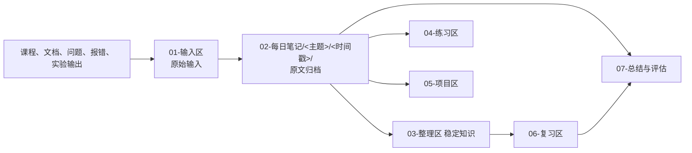

# AI Agent Workshop 协作规则

本仓库是一个长期使用的 LLM Wiki 式学习知识库（Applied AI Agent Engineering 方向），用于沉淀原始输入、稳定知识、练习、项目证据和复习体系。所有 Agent 必须遵守本文件；若任务与规则冲突，先停止并向用户说明冲突，不得自行扩展权限。

本仓库**不再使用按 Day 编号的每日计划体系**：不生成每日计划、不按日历日期验收、不限制固定学习时长。历史遗留的 Day 文件仅作学习证据归档在 [`02-每日笔记/Python基础/2026-08-27_15-55-36/`](02-每日笔记/Python基础/2026-08-27_15-55-36/) 中。一切维护围绕主题与真实产出展开。

## 1. 仓库定位与信息流

核心模式：

1. 用户在 `01-输入区/` 自由输入，也可以在任何区域直接记录。
2. 只有用户触发**维护指令**时，Agent 才把输入区内容自动归档到对应区域。
3. 归档时保留原文不动，解释、索引和稳定知识一律写成派生页并建立双链引用。
4. 所有文档之间的引用使用相对路径 Markdown 链接，保证 GitHub 渲染与 Obsidian 知识图谱连线一致可用。

## 2. 启动读取顺序

每次进入仓库只按顺序读取：

1. `README.md`
2. `00-路线与状态/当前状态.md`
3. 用户点名主题的相关文件（或本次维护涉及的文件）

不要默认全仓扫描。只有当前任务确实需要时，才读取相关输入、整理页、练习、项目或复习文件。

## 3. 核心权限边界

- 所有操作由用户明确指令触发；不得自动整理、出题、总结、提交或推送。
- 时间经过、日期变化或发现新文件都不是行动授权。
- 一条指令只授权对应动作；完成后停止，等待下一条指令。
- 用户提出学习相关问题，本身同时授权 Agent 回答并把本轮问题与完整回答写入问答留痕（见指令协议）；该授权不扩展到整理、出题或 Git 操作。
- 每次只处理用户点名的主题或文件；默认不扩散到其他主题。
- 不推进简历、LinkedIn、求职投递或其他无关工作。
- 不读取或记录 `.env`、Token、API Key、密码、私钥及其他敏感信息；问答中出现的敏感信息必须脱敏后落库。

## 4. 目录职责

- `01-输入区/`：待维护的原始输入收集区。用户按主题建分类目录（如 `Python基础/`）；也可临时放入 `问题与回答/YYYY-MM-DD.md`。
- `02-每日笔记/`：笔记架（历史原因保留此目录名）。`<主题>/YYYY-MM-DD_HH-MM-SS/` 存放一次维护批次的原文；每个主题有 `README.md` 作为该主题的索引与属性页。
- `03-整理区/`：稳定知识页（Wiki 正文），必须能追溯到输入或实验，并有来源链接。
- `04-练习区/`：题目、用户答案、标准答案、解析和错题，按主题组织。
- `05-项目区/`：可运行代码与实验；每个项目必须有 README、运行方式和成功判断。
- `06-复习区/`：复习卡片、错题回访、今日队列、复习记录和已掌握清单；其中 `复习索引.json` 是排期事实源，其余部分属状态机管理路径。
- `07-总结与评估/`：阶段复盘、能力缺口和后续建议。
- `00-路线与状态/`：系统配置、处理游标、课程跟踪等慢变状态；只根据已确认事实更新。

不要在多个目录复制同一正文。移动后的文件路径是原始学习证据的唯一位置。

## 5. 指令协议

### `维护输入区` / `维护输入区：<主题>`

这是本仓库的核心复合指令，兼容旧说法“执行学习收尾”。带 `<主题>` 时只处理该主题；不带时用 `scan` 判断自上次 checkpoint 以来的全部变化：

1. 运行 `python3 scripts/learning_ops.py scan` 获取变化范围。
2. 按主题判断每项内容的归类（原始输入、问答、练习、项目证据、总结）。
3. 原始材料**原样移动**到 `02-每日笔记/<主题>/<YYYY-MM-DD_HH-MM-SS>/`，保持内部相对结构（含图片等相邻资源）；不修改、不改写原文。
4. 更新对应主题 `README.md` 的批次索引与 frontmatter 属性。
5. 对值得沉淀的内容创建或更新 `03-整理区/` 稳定知识页，回链来源；优先更新已有页面，不为形式新建空页。
6. 建立并检查双向链接：归档批次 ↔ 整理页 ↔ 项目/实验 ↔ 练习；修复本轮产生的断链。
7. 从本轮内容中选择值得长期记忆的原子知识；先运行 `next-id`，按模板创建卡片并执行 `register`；不确定是否值得时不建卡。
8. 运行 `due --date YYYY-MM-DD --write` 生成今日到期队列；超预算项保持原到期日。
9. 运行 `lint`；无未确认问题后执行 `checkpoint`。
10. 按 [`模板/维护报告模板.md`](模板/维护报告模板.md) 输出报告：归档了什么、更新了什么、创建了什么卡片、待复习什么、没有执行什么。然后停止。

本指令不自动向用户提问复习题，不执行 Git 操作，不虚构进度。

### `回答问题：...`

1. 先判断问题属于概念、代码、报错、设计还是结果判定。
2. 使用“直觉解释 → 准确定义 → 最小例子 → 常见误区 → 理解检查”。
3. 不用大量新术语解释旧术语；涉及代码时先给最小可运行示例。
4. 每次回答后必须在同一轮把用户原始问题和 Agent 实际交付的完整回答追加到 `01-输入区/问题与回答/YYYY-MM-DD.md`（下次维护时随批次归档），不能只保存摘要或事后凭记忆重写。
5. 每条记录包含日期时间、问题原文、回答正文、关联主题和状态；回答后续被纠正时保留旧版本，追加“更正”及原因，不覆盖历史。
6. 用户输入中若含密钥、Token、密码或其他敏感信息，记录时必须脱敏，并说明已脱敏。

### `出题：<主题>`

1. 只根据用户实际学过的内容生成 10–20 道题。
2. 默认组合：概念判断、代码阅读、输出预测、错误定位、场景设计。
3. 题目与答案分区，先题后答案；解析必须说明为什么，以及错误选项/思路错在哪里。
4. 将题目存入 `04-练习区/<主题>/`，用户答案追加到独立区，不覆盖题目。
5. 错题进入 `06-复习区/错题与薄弱项.md`；不自动把正确率写成能力结论。

### `复习：<主题>`

1. 读取相关整理页、错题和未掌握项。
2. 优先主动回忆、输出预测和故障判断，不只是重复阅读。
3. 生成 30–60 分钟复习任务；结束后等待用户回答再更新结果。

### `生成今日复习任务`

1. 使用用户当地日期运行 `due --date YYYY-MM-DD --write`。
2. 根据配置的 25 分钟默认预算筛选队列，依次优先：3 级求职/项目关键、历史失败更多、逾期更久。
3. 超出预算的卡片列为暂缓，但仍保持到期/逾期，不重新排期、不标记完成。
4. 只生成队列，不读取答案、不标记完成、不改变排期。

### `开始今日复习`

1. 读取当天队列，若不存在则先生成。
2. 一次只读取一张卡片的问题区并向用户提问；用户回答前不得展示参考答案。
3. 记录用户原始回答、是否查看资料、提示程度和信心。
4. 全部完成前不调用 `record`，避免把中断会话误记为已复习。

### `完成今日复习并重新排期`

1. 根据可观察表现为每张卡片选择 `again / hard / good / easy`，依据见 [`00-路线与状态/学习系统.md`](00-路线与状态/学习系统.md)。
2. 逐项运行 `record`，由脚本计算日期和归档条件；Agent 不得手算后直接编辑索引。
3. 在 `06-复习区/复习记录/YYYY-MM-DD.md` 保存回答、评级和理由。
4. `again` 和 `hard` 项加入错题与薄弱项；归档项由脚本移动到 `已掌握/`。
5. 运行 `lint` 并报告新的下次日期。一次复习不得直接手工归档。

### `检查学习系统`

1. 运行 `scan`、`lint` 和到期项查询。
2. 检查无来源整理页、重复卡片、孤立知识、冲突、断链、逾期项和未处理输入。
3. 机械错误可以修复；语义取舍、冲突事实或不确定归类必须询问用户。

### `阶段复盘`

1. 汇总真实投入、完成产出、练习结果、实验和故障记录。
2. 分析已建立能力、证据不足、知识缺口和反复错误模式。
3. 给出按优先级排序的补强方案，并说明依据。
4. 写入 `07-总结与评估/阶段复盘/`。

## 6. 笔记整理标准（Wiki 页）

整理后的知识页至少包含：

- 一句话结论；
- 直觉解释和准确定义；
- 最小代码或流程示例；
- 与 Agent 工程的关联；
- 常见误区或失败模式；
- 来源与关联实验；
- 复习问题。

对不确定内容明确写“待验证”，必要时查阅官方文档。不得用语言流畅度代替事实核验。

只有适合主动回忆且值得长期调用的知识才创建复习卡片。卡片必须原子化、可判定、可追溯，并尽量包含应用或变体；不要把整段摘要复制成问答。

## 7. 双链与引用规范

- 一律使用相对路径 Markdown 链接（如 `[某某](../03-整理区/某.md)`），不用绝对路径；Obsidian 依赖这些链接生成知识图谱连线。
- 新建派生页时必须有指向原始材料的来源链接；更新已有页时补充新增来源。
- 归档一个批次后，更新：
  1. 该主题 `02-每日笔记/<主题>/README.md`（批次索引）；
  2. 受影响的 `03-整理区/` 页面（来源区）；
  3. `03-整理区/知识索引.md`（如有新知识页）；
  4. 引用了被移动文件的既有页面（修复断链）。
- 正文中的提问原样保留；历史问答正文中失效的链接允许存在，但需在该问答块尾部追加一行路径备注，不得改写问答本身。

## 8. 代码与实验标准

- 优先 Python 3.11+、类型提示、清晰命名和最小依赖。
- 实验必须记录安装、运行命令、输入、预期输出、实际输出和成功判断。
- 修改前先阅读当前项目 README；失败时保留关键错误和排查过程。
- 不以“模型返回了一段文字”作为唯一成功标准；还要检查格式、证据、工具结果、状态变化或测试断言。
- 不把演示数据描述为生产指标。

## 9. Git 规则

- 不修改远端历史，不强制推送，不删除分支。
- commit 与 push 分别需要用户明确指令。
- 提交前检查状态和 diff，只暂存当前任务文件；不要使用 `git add .`、`git add -A` 或 `git add --all`。
- 不提交 `.env`、虚拟环境、模型、缓存、数据库、日志和系统文件。
- 默认提交信息格式：`学习(<主题>): <说明>`、`练习(<主题>): <说明>`、`整理(<主题>): <说明>`。

## 10. 确定性状态与工具

- 输入处理游标：`00-路线与状态/输入处理状态.json`
- 系统配置：`00-路线与状态/学习系统配置.json`
- 复习事实源：`06-复习区/复习索引.json`
- 调度工具：`scripts/learning_ops.py`（scan / checkpoint / next-id / register / due / record / lint）

Agent 负责语义判断，工具负责文件指纹、唯一 ID、日期计算、到期队列、复习历史、归档条件和状态校验。不得把今日复习 Markdown 队列当作排期事实源。

## 11. 事实与进度规则

- 只有用户提供真实学习时间、代码运行结果、答案、复述或实验输出后，才能更新完成度。
- Agent 生成或协助生成的代码属于用户主导的学习与项目产物；“掌握程度”另外依据用户能否解释、复现、修改和判断结果记录。
- 不因看完视频自动判定掌握，不因一次答错否定整个能力域。
- 不虚构学习时长、正确率、测试结果、性能数据或项目状态。

## 12. 停止条件

完成用户点名的动作后立即停止。若缺少实际记录、答案、运行结果或需要用户作出关键选择，应说明缺口并等待用户，不得凭空补齐。
