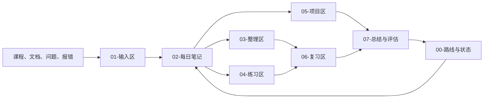

# AI Agent Workshop

这是一个为期一周、每天约 8 小时的 Applied AI Agent Engineering 基础强化仓库。它同时承担学习路线、原始输入、每日笔记、知识整理、练习测验、实验项目、复习和阶段评估的统一事实源。

当前目标不是在七天内覆盖所有 AI/ML 内容，而是建立继续推进企业级 Agent 项目所需的最小工程基础：

- 能阅读、运行和修改基础 Python 代码；
- 理解 LLM 调用、结构化输出、RAG、工具调用和 Agent 状态编排；
- 能用实验、测试、日志和评测判断 AI 系统行为；
- 能解释实现选择、失败路径、幻觉治理和生产约束；
- 为后续 AtlasOps 项目学习与技术面试建立可复习的知识证据。

## 当前状态

- 计划周期：7 天
- 计划投入：56 小时
- 当前进度：0 / 56 小时
- 当前学习日：尚未开始 Day 1
- AtlasOps 功能开发：暂停
- 简历、LinkedIn 与投递：暂停

权威状态见 [`00-路线与状态/当前状态.md`](00-路线与状态/当前状态.md)。只有真实完成学习、实验、答题或复述后才能更新进度。

## 仓库结构

```text
ai-agent-workshop/
├── 00-路线与状态/       # 总路线、当天状态、资源和进度
├── 01-输入区/           # 用户原始笔记、课程摘录、问题和报错
├── 02-每日笔记/         # Day 1–7 的工作台与学习记录
├── 03-整理区/           # 从原始记录提炼出的稳定知识
├── 04-练习区/           # 每日题目、答案、解析和错题
├── 05-项目区/           # Python 小练习、RAG、Agent、LangGraph 实验
├── 06-复习区/           # 复习清单、知识卡片、错题回访和口述提纲
├── 07-总结与评估/       # 每日总结、阶段复盘、能力缺口和下一步
├── 模板/                # 每日记录、练习题和复盘模板
├── AGENTS.md            # 所有 Agent 的协作与权限规则
└── README.md            # 仓库入口
```

## 信息流



## 如何与 Agent 协作

所有动作都必须由你主动触发。Agent 不得因为打开仓库、发现新笔记或到达某个时间就自动执行。

常用指令：

```text
安排 Day 1：根据路线图和当前状态生成今天的 8 小时任务，不推进其他事项。

回答问题：<你的问题>。先解释直觉，再给最小例子，最后检查我是否理解。

整理 Day 1：保留我的原始输入，整理当天笔记、补充注释并更新进度。

出题 Day 1：根据今天实际学过的内容出 10–20 道题，提供独立答案和解析。

复习 Day 1：根据错题和未掌握项安排一次短复习。

阶段复盘：总结当前进度、已建立的能力证据、欠缺和补强方案。

调整 Day 2：根据 Day 1 的真实结果调整下一天计划，并说明调整原因。
```

完整规则见 [`AGENTS.md`](AGENTS.md)。

## 每日完成标准

一天只有同时满足以下条件，才标记为完成：

1. 完成当天至少一个可运行实验；
2. 能脱离资料解释当天主题 3–5 分钟；
3. 当天练习题达到至少 80%，并能说明理由；
4. 记录至少一个“现象 → 假设 → 检查 → 结论 → 验证”的错误闭环；
5. 明确写出“现在能做什么”和“仍然不懂什么”。

如果没有通过，不需要重学整天；未掌握项进入下一天前 45 分钟的补洞区。

## 本地运行原则

- 预算为 0，优先使用 M4 MacBook Pro、32 GB RAM 和本机 Ollama。
- 不为跟课购买付费 API；必要时使用 Ollama 的 OpenAI-compatible 接口改写示例。
- Python 虚拟环境、模型文件、缓存、数据库和密钥不提交到 Git。
- 不在仓库中保存 Token、API Key、密码、私钥或个人敏感信息。

## Git 使用

日常学习内容可以按天提交。Agent 只有在收到明确的 `提交` 或 `推送` 指令时，才能执行对应操作；整理笔记不等于授权 Git commit，commit 也不等于授权 push。
