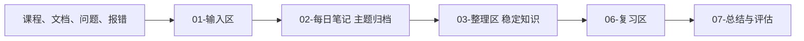

# AI Agent Workshop

这是一个长期使用的 LLM Wiki 式学习知识库（Applied AI Agent Engineering 方向）。它同时承担原始输入、知识整理、练习测验、实验项目、复习和阶段评估的统一事实源，围绕主题而非日历日期组织一切内容。

学习目标：为推进企业级 Agent 项目建立工程基础——能阅读运行 Python、理解 LLM 调用 / 结构化输出 / RAG / 工具调用 / Agent 编排，并用实验、测试、日志和评测判断 AI 系统行为。

当前权威状态见 [`00-路线与状态/当前状态.md`](00-路线与状态/当前状态.md)。

## 使用方式

你只需要记住一个流程：

1. **输入**：把课程笔记、代码、报错、问题和实验输出随手放进 `01-输入区/<主题>/`。
2. **提问**：随时用 `回答问题：<你的问题>` 提问；问题和完整回答会自动留痕，不需要你说"记录"。
3. **维护**：感觉攒了一批后说 `维护输入区`（或 `维护输入区：<主题>`），Agent 会自动完成归档 → 建立稳定知识页 → 双链互引 → 复习卡片 → 到期队列 → 检查并输出报告。
4. **复习**：说 `开始今日复习`，完成后说 `完成今日复习并重新排期`。

其他可用指令：`出题：<主题>`、`复习：<主题>`、`检查学习系统`、`阶段复盘`、`提交` / `推送`（Git 单独授权）。

完整规则见 [`AGENTS.md`](AGENTS.md)；复习系统原理见 [`00-路线与状态/学习系统.md`](00-路线与状态/学习系统.md)。

## 仓库结构

```text
ai-agent-workshop/
├── 01-输入区/           # 原始输入收集区：课程摘录、代码、报错、问答
├── 02-每日笔记/         # 笔记架：<主题>/<维护时间戳>/ 存放原文归档
├── 03-整理区/           # Wiki 正文：稳定知识页 + 知识索引
├── 04-练习区/           # 题目、答案、解析和错题
├── 05-项目区/           # 可运行项目与实验快照
├── 06-复习区/           # 知识卡片、今日队列、错题回访、已掌握
├── 07-总结与评估/       # 阶段复盘、能力缺口
├── 00-路线与状态/       # 当前状态、系统配置、处理游标、课程跟踪
├── 模板/                # 各类页面模板
├── scripts/             # scan/checkpoint/lint/due 等确定性工具
├── AGENTS.md            # 所有 Agent 的协作与权限规则
└── README.md            # 本文件
```

## 信息流与知识图谱

所有文档之间的引用使用相对路径 Markdown 链接；用 Obsidian 打开本目录即可在 Graph 视图查看主题间的连线：



## 主要入口

- [知识索引](03-整理区/知识索引.md) · [Python 基础](02-每日笔记/Python基础/README.md) · [问题与回答](02-每日笔记/问题与回答/README.md)
- [Python+AI 课程跟踪](00-路线与状态/Python+AI课程跟踪.md) · [学习资源清单](00-路线与状态/学习资源.md)
- [学习进度台账](00-路线与状态/学习进度.md) · [项目快照](05-项目区/Synora-Agentic-ERP-snapshot-2026-08-27/README.md)

## 本地运行原则

- 预算为 0，优先使用 M4 MacBook Pro、32 GB RAM 和本机 Ollama。
- 不为跟课购买付费 API；必要时使用 Ollama 的 OpenAI-compatible 接口改写示例。
- Python 虚拟环境、模型文件、缓存、数据库和密钥不提交到 Git。
- 不在仓库中保存 Token、API Key、密码、私钥或个人敏感信息。

## Git 使用

Agent 只有在收到明确的 `提交` 或 `推送` 指令时才执行对应操作；整理笔记不等于授权 commit，commit 也不等于授权 push。提交信息按主题命名，如 `学习(Python基础): 列表切片练习`。
